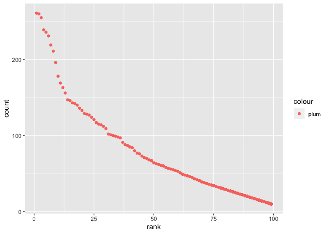

p8105\_hw2\_jl5548
================
J L
September 25, 2019

Problem 1
---------

1.  Read and clean the Mr. Trash Wheel sheet:

-   specify the sheet in the Excel file and to omit non-data entries (rows with notes / figures; columns containing notes) using arguments in read\_excel
-   use reasonable variable names
-   omit rows that do not include dumpster-specific data
-   round the number of sports balls to the nearest integer and converts the result to an integer variable (using as.integer)

``` r
MrWheel = read_excel("./data/HealthyHarborWaterWheelTotals2018-7-28.xlsx", sheet = "Mr. Trash Wheel", range = "A2:N336") %>% 
  drop_na() %>% 
  janitor::clean_names() %>% 
  mutate(sports_balls = as.integer(round(sports_balls)))
```

1.  Read and clean precipitation data for 2017 and 2018. For each, omit rows without precipitation data and add a variable year. Next, combine precipitation datasets and convert month to a character variable (the variable month.name is built into R and should be useful).

``` r
precip_2017 = read_excel("./data/HealthyHarborWaterWheelTotals2018-7-28.xlsx", sheet = "2017 Precipitation", range = "A2:B14") %>% 
  drop_na() %>% 
  janitor::clean_names() %>% 
  mutate(year = 2017) 
precip_2018 = read_excel("./data/HealthyHarborWaterWheelTotals2018-7-28.xlsx", sheet = "2018 Precipitation", range = "A2:B14") %>% 
  drop_na() %>% 
  janitor::clean_names() %>% 
  mutate(year = 2018) 
precip_join = rbind(precip_2017, precip_2018) %>% 
  mutate(month = month.name[month])
```

1.  Write a paragraph about these data; you are encouraged to use inline R. Be sure to note the number of observations in both resulting datasets, and give examples of key variables. For available data, what was the total precipitation in 2018? What was the median number of sports balls in a dumpster in 2017?

There are 285 observations in MrWheel dataset, and 19 observations in precip\_join dataset. MrWheel dataset contains data of 285 dumpsters from 2014-05-16 to 2018-07-28. The total precipitation in 2018 is 23.5, and the total precipitation in 2017 is 32.93. The median number of sports balls in a dumpster in 2017 is 8.

Problem 2
---------

1.  First, clean the data in pols-month.csv. Use separate() to break up the variable mon into integer variables year, month, and day; replace month number with month name; create a president variable taking values gop and dem, and remove prez\_dem and prez\_gop; and remove the day variable.

``` r
pols = read_csv("./data/fivethirtyeight/pols-month.csv") %>% 
  janitor::clean_names() %>%
  separate(col = mon, into = c("year", "month", "day"), sep = "-") %>% 
  mutate(month = month.name[as.numeric(month)]) %>% 
  mutate(president = if_else(prez_gop == 0, "democreatic", "republican")) %>% 
  select(-day, -prez_gop, -prez_dem)
```

    ## Parsed with column specification:
    ## cols(
    ##   mon = col_date(format = ""),
    ##   prez_gop = col_integer(),
    ##   gov_gop = col_integer(),
    ##   sen_gop = col_integer(),
    ##   rep_gop = col_integer(),
    ##   prez_dem = col_integer(),
    ##   gov_dem = col_integer(),
    ##   sen_dem = col_integer(),
    ##   rep_dem = col_integer()
    ## )

1.  Second, clean the data in snp.csv using a similar process to the above. For consistency across datasets, arrange according to year and month, and organize so that year and month are the leading columns.

``` r
snp = read_csv("./data/fivethirtyeight/snp.csv") %>% 
  janitor::clean_names() %>%
  separate(col = date, into = c("month", "day", "year"), sep = "/") %>% 
  mutate(month = month.name[as.numeric(month)]) %>% 
  select(year, month, day, close) %>% 
  arrange(year, month)
```

    ## Parsed with column specification:
    ## cols(
    ##   date = col_character(),
    ##   close = col_double()
    ## )

1.  Third, tidy the unemployment data so that it can be merged with the previous datasets. This process will involve switching from “wide” to “long” format; ensuring that key variables have the same name; and ensuring that key variables take the same values.

``` r
unemploy = read_csv("./data/fivethirtyeight/unemployment.csv") %>% 
  janitor::clean_names() %>%
  pivot_longer(
    cols = jan:dec,
    names_to = "month",
    values_to = "unemployment_percent"
    ) %>% 
  mutate(month = replace(month, values = month.name), year = as.character(year)) %>% 
  drop_na()
```

    ## Parsed with column specification:
    ## cols(
    ##   Year = col_integer(),
    ##   Jan = col_double(),
    ##   Feb = col_double(),
    ##   Mar = col_double(),
    ##   Apr = col_double(),
    ##   May = col_double(),
    ##   Jun = col_double(),
    ##   Jul = col_double(),
    ##   Aug = col_double(),
    ##   Sep = col_double(),
    ##   Oct = col_double(),
    ##   Nov = col_double(),
    ##   Dec = col_double()
    ## )

1.  Join the datasets by merging snp into pols, and merging unemployment into the result.

``` r
pols_snp = left_join(pols, snp, by = c("year", "month"))
pols_snp_unemploy = left_join(pols_snp, unemploy, by = c("year", "month"))
```

1.  Write a short paragraph about these datasets. Explain briefly what each dataset contained, and describe the resulting dataset (e.g. give the dimension, range of years, and names of key variables).

The pols dataset has 822 observations of 9 variables, providing number of governors/senators/representatives from each political parties (republican or democratic), as well as whether the president is republican or democratic, every month from January, 1947 to June, 2015. The key variable president indicates whether the president at the given month is a republican (prez\_gop = 1/2) or democratic (prez\_dem = 1). The snp dataset has 787 observations of 4 variables, related to Standard & Poor's stock market index (S&P) from 1950 to 2015. Some of the key variables are close, year and month. The key variable close represents the closing values of the S&P stock index on the given date. The unemploy dataset has 810 observations of 3 variables, showing the unemployment percentage of each month from 1948 to 2015. The key variable unemployment\_percent shows the percentage of unemployment at the given month and year. The pols\_snp dataset has822 observations of 11 variables. It's a combination of datasets pols and snp, showing both the political parties information and closing values of the S&P stock index on the given date. Since snp dataset contains the variable day whereas the pols dataset does not, the day variable was added to the combination dataset. Both day and close variables contain some NAs, as the closing values of some dates are not available. The posl\_snp\_unemploy dataset has 822 observations of 12 variables. It's a combination of datasets pols, snp, and unemploy, containing information of political parties, closing values of S&P stock index, and unemployment percentage at the given date. Similarly as in the previous dataset, there are some NAs in the variable unemployment\_percent, as the percentage at some dates are not available.

Problem 3
---------

1.  Load and tidy the data. Note that, although these data may seem fairly well formatted initially, the names of a categorical predictor and the case structure of string variables changed over time; you’ll need to address this in your data cleaning. Also, some rows seem duplicated, and these will need to be removed (hint: google something like “dplyr remove duplicate rows” to get started).

``` r
baby_names = read_csv("./data/Popular_Baby_Names.csv") %>% 
  janitor::clean_names() %>% 
  distinct() %>% 
  mutate(ethnicity = recode(ethnicity, "WHITE NON HISP" = "WHITE NON HISPANIC", "BLACK NON HISP" = "BLACK NON HISPANIC", "ASIAN AND PACI" = "ASIAN AND PACIFIC ISLANDER")) %>% 
  mutate(childs_first_name = toupper(childs_first_name)) 
```

    ## Parsed with column specification:
    ## cols(
    ##   `Year of Birth` = col_integer(),
    ##   Gender = col_character(),
    ##   Ethnicity = col_character(),
    ##   `Child's First Name` = col_character(),
    ##   Count = col_integer(),
    ##   Rank = col_integer()
    ## )

1.  Produce a well-structured, reader-friendly table showing the rank in popularity of the name “Olivia” as a female baby name over time; this should have rows for ethnicities and columns for year. Produce a similar table showing the most popular name among male children over time.

``` r
rank_olivia = baby_names %>% 
  filter(childs_first_name == "OLIVIA") %>% 
  select(year_of_birth, childs_first_name, ethnicity, rank) %>% 
  pivot_wider(
    names_from = "year_of_birth",
    values_from = "rank", 
    id_cols = "ethnicity"
  )
knitr::kable(rank_olivia)
```

| ethnicity                  |  2016|  2015|  2014|  2013|  2012|  2011|
|:---------------------------|-----:|-----:|-----:|-----:|-----:|-----:|
| ASIAN AND PACIFIC ISLANDER |     1|     1|     1|     3|     3|     4|
| BLACK NON HISPANIC         |     8|     4|     8|     6|     8|    10|
| HISPANIC                   |    13|    16|    16|    22|    22|    18|
| WHITE NON HISPANIC         |     1|     1|     1|     1|     4|     2|

``` r
rank_male = baby_names %>% 
  filter(gender == "MALE", rank == 1) %>% 
  select(year_of_birth, childs_first_name, ethnicity, rank) %>% 
  pivot_wider(
    names_from = "year_of_birth",
    values_from = "childs_first_name", 
    id_cols = "ethnicity"
  )
knitr::kable(rank_male)
```

| ethnicity                  | 2016   | 2015   | 2014   | 2013   | 2012   | 2011    |
|:---------------------------|:-------|:-------|:-------|:-------|:-------|:--------|
| ASIAN AND PACIFIC ISLANDER | ETHAN  | JAYDEN | JAYDEN | JAYDEN | RYAN   | ETHAN   |
| BLACK NON HISPANIC         | NOAH   | NOAH   | ETHAN  | ETHAN  | JAYDEN | JAYDEN  |
| HISPANIC                   | LIAM   | LIAM   | LIAM   | JAYDEN | JAYDEN | JAYDEN  |
| WHITE NON HISPANIC         | JOSEPH | DAVID  | JOSEPH | DAVID  | JOSEPH | MICHAEL |

1.  Finally, for male, white non-hispanic children born in 2016, produce a scatter plot showing the number of children with a name (y axis) against the rank in popularity of that name (x axis).

``` r
scatter = baby_names %>% 
  filter(gender == "MALE", year_of_birth == 2016, ethnicity == "WHITE NON HISPANIC")
scatter_plot = scatter %>% 
  ggplot(aes(x = rank, y = count, color = "plum")) + geom_point()
scatter_plot
```


